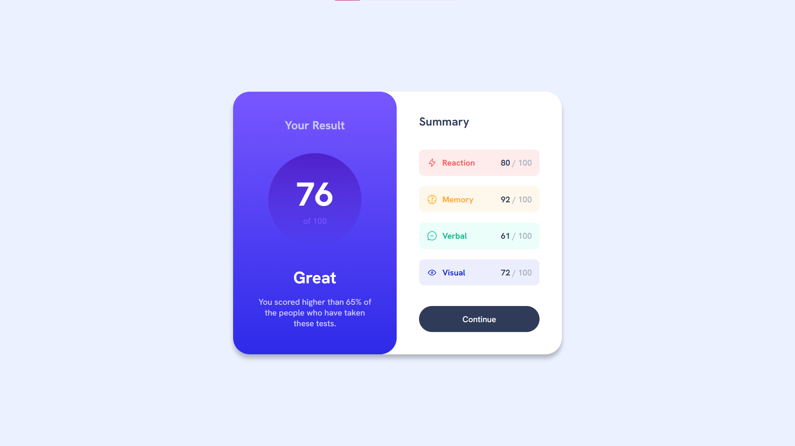
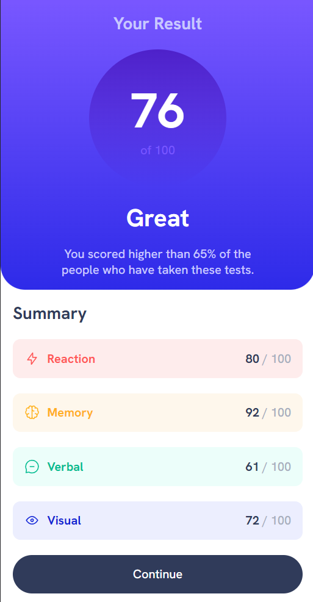

# Results summary component solution

This is a solution to the [Results summary component challenge on Frontend Mentor](https://www.frontendmentor.io/challenges/results-summary-component-CE_K6s0maV). 

 

## Table of contents

- [Screenshot](#screenshot)
- [Links](#links)
- [Built with](#built-with)
- [What I learned](#what-i-learned)
- [Author](#author)

 

## Screenshot

 

## Links

- Solution URL: [click here](https://www.frontendmentor.io/solutions/first-challenge-W_QW_7g8db)
- Live site URL: [click here](https://linen220.github.io/tarjeta-resumen/)

 

## Built with

-    
-    

 

## What I learned

* Usage of **flex** layout's properties in css.
* Used HTML5 semantic elements for better accessability and readability.
* Used Git and GitHub for project management.
* Used media queries for responsive design.
* Tried to maintain clean code.

 

# Author

- Frontend Mentor - [@Linen220](https://www.frontendmentor.io/profile/Linen220)
- Github - Linen220

 